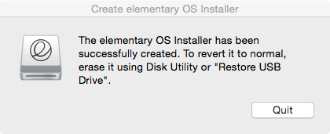

# Create elementary OS Installer

A simple Applescript app for creating elementary OS Installer USB drives. It uses dd as a backend. It should work on any version of OS X, although it has only been tested on OS X 10.10.5. The resulting USB drive should boot on newer Macs, as well as PCs.

## System Requirements

Only the following Macs are capable of starting up elementary OS/Linux from a USB drive:

- Macbook7,1 (Mid 2010) or newer
- MacBook Pro7,1 (Mid 2010) or newer
- MacBook Air3,2 (Late 2010) or newer
- Mac Mini5,1 (Mid 2011) or newer
- iMac13,1 (Late 2012) or newer
- Mac Pro5,1 (Mid 2010) or newer

Please don't create a bug report if your Mac is below the system requirements. Check out the [Mac Linux USB Loader](https://github.com/SevenBits/Mac-Linux-USB-Loader) instead.

## Instructions

### Get the app

Click the "Download Zip" link on this page and open the app.

### Select the elementary OS ISO file

### Select the USB drive you wish to use and confirm you want to use it

### Enjoy your Installer

(Note: the UI text might differ from shown.)

## Credits:

Most of this comes from Sam Daitzman's [elementary thumbdrive creator](https://github.com/sdaitzman/elementary-thumbdrive-creator) with a large restructuring of the UI flow, a reduction in UI text, and the removal of the ISO conversion process.

The elementary logo in the icon is from elementary LLC.

## Disclaimer

This software is provided as is, without any warranty that it'll work.
